<div align="center">

# 🥦 ExpiryWise
### Smart Food Expiry & Kitchen Inventory Management System

[](https://www.oracle.com/java/)
[](https://openjfx.io/)
[](https://www.sqlite.org/)
[](https://maven.apache.org/)
[](#)
[](LICENSE)
[](#)

**ExpiryWise** is an intelligent, high-performance desktop platform designed to eliminate domestic food waste, organize household pantries, calculate real-time perishable decay rates, provide proactive expiration warnings and automate grocery replenishment.

</div>

---

## 📌 Table of Contents

- [🎯 Problem Statement & Motivation](#-problem-statement--motivation)
- [✨ Core System Features](#-core-system-features)
  - [I. Authentication & Security](#i-authentication--security)
  - [II. Inventory Dashboard & Freshness Meter](#ii-responsive-inventory-dashboard--freshness-meter)
  - [III. Search, Filtering & Sorting](#iii-live-search-multi-filter--sorter)
  - [IV. Food Management & Custom Media](#iv-food-item-management--custom-media)
  - [V. Expiration Alerts & Notifications](#v-expiration-alert--urgency-triage-center)
  - [VI. Interactive Expiry Calendar](#vi-interactive-monthly-expiry-calendar)
  - [VII. Smart Shopping List & Restock Automation](#vii-smart-shopping-list--auto-add-expiring-restock)
  - [VIII. Kitchen Analytics & Health Score](#viii-data-driven-kitchen-analytics--health-score)
  - [IX. Theme Engine & Settings](#ix-design-system-theme-engine--settings)
- [📸 Screenshots](#-screenshots)
- [📊 System Documentation & Academic Analysis](#-system-documentation--academic-analyses)
  - [Feature Comparison](#1-feature-comparison-across-existing-solutions)
  - [Gap Analysis & Solutions](#2-gap-analysis-and-solutions-matrix)
  - [Technology Stack Justification](#3-technology-stack-justification)
- [🏗️ System Architecture & Design](#️-system-architecture--design-patterns)
  - [Layered Architecture](#5-tier-layered-architecture-diagram)
  - [Project Directory Structure](#annotated-project-directory-tree)
- [💾 Database Schema & Normalization](#-database-schema--normalization)
- [👥 Team Structure & Contributions](#-team-structure--roles)
  - [Workload Allocation Matrix](#workload-allocation-matrix)
  - [Detailed Team Contributions](#in-depth-documentation-team_contributionsmd)
- [🚀 Installation & Setup](#-installation--setup-guide)
  - [Prerequisites](#prerequisites)
  - [Option A: Automated Setup](#option-a-automated-1-click-setup-recommended)
  - [Option B: Manual Terminal Setup](#option-b-manual-terminal-execution)
  - [Option C: Visual Studio Code Setup](#option-c-visual-studio-code-setup)
  - [Demo Evaluation Credentials](#demo-evaluation-credentials)
- [🧪 Quality Assurance & Testing](#-quality-assurance--testing)
- [🔮 Future Scope & Roadmap](#-future-scope--roadmap)
- [📄 License & Institutional Context](#-license--institutional-context)

---

## 🎯 Problem Statement & Motivation

Residential food wastage is an alarming worldwide crisis that carries massive financial, environmental and ethical repercussions. According to the **United Nations Environment Programme (UNEP) Food Waste Index Report**, households globally discard over **1 billion meals every single day**, with domestic residential kitchens accounting for approximately **60%** of total food waste.

In urban domestic environments, families and university students routinely purchase groceries in bulk without maintaining an accurate, accessible register of their items. Perishables-such as dairy products, fresh produce, meat, fish and baked goods are routinely shoved to the rear compartments of refrigerators and dark pantry shelves. By the time consumers realize these items exist, they have deteriorated past their consumption dates, rendering them hazardous and inedible.

```
┌────────────────────────────────────────────────────────────────────────────────────────┐
│                                 THE DOMESTIC WASTE CYCLE                               │
│                                                                                        │
│ Bulk Purchase ──► Forgotten in Fridge/Pantry ──► Spoiled Unnoticed ──► Dumped to Trash │
│         ▲                                                                      │       │
│         └────────────── Re-purchased Blindly (Financial Loss) ◄────────────────┘       │
└────────────────────────────────────────────────────────────────────────────────────────┘
```

Existing solutions fail to resolve this issue effectively:
- **Manual Methods (Paper / Spreadsheets)**: High cognitive friction, lack visual card layouts, offer no automated proactive notifications and fail to provide restock linkages.
- **Commercial Mobile Utilities**: Demand invasive monthly cloud subscriptions, sell domestic consumption habits to ad networks, require constant internet connectivity and suffer from bloated interfaces.

**ExpiryWise** directly addresses this crisis by delivering a dedicated, privacy-focused, zero-latency desktop platform supporting **United Nations Sustainable Development Goal 12 (Target 12.3)** to halve consumer food waste.

---

## ✨ Core System Features

### I. Authentication & Security
- 🔑 **Dual-Mode Onboarding**: Switch seamlessly between Sign In and Account Registration in a single animated view.
- 🔒 **Cryptographic Password Digest**: Passwords are never stored in plaintext; hashed via standard **SHA-256** message digest before SQLite persistence.
- 🛡️ **Validation Pipeline**: Client-side validation enforcing RFC-compliant email syntax, minimum 4-character passwords and double-entry confirmation matching.
- ⚡ **Quick Demo Sign-In**: Instant one-click evaluation bypass pre-seeded with `demo@expirywise.app` / `password123`.

### II. Responsive Inventory Dashboard & Freshness Meter
- 🍱 **Fluid Card Viewport**: Responsive grid layout with dynamic column scaling (1 to 4 columns) adapting automatically to window resize events.
- 🖼️ **Smart Image Fallback**: Resolves user-uploaded local photographs; if none exist, seamlessly renders high-resolution stock imagery for Dairy, Fruits, Vegetables, Meat, Fish, Drinks, Snacks and Frozen Food.
- ⏱️ **Visual Freshness Progress Bar**: Animated meter calculating the exact percentage of shelf-life remaining based on purchase dates.
- ❤️ **Interactive Favorite Tagging**: Heart toggle button saving favorite status directly to SQLite with dynamic sort prioritization.

### III. Live Search, Multi-Filter & Sorter
- 🔎 **Real-Time Keystroke Search**: Instantaneous search matching across food titles, categories and storage locations simultaneously.
- 🗂️ **Category Filtering**: Isolate items across 9 culinary classifications: *Fruits, Vegetables, Dairy, Meat, Fish, Drinks, Snacks, Frozen Food, Others*.
- 🚦 **Status Filtering**: Filter by condition: *Safe, Use Soon, Expires Today, Expired*.
- 🔄 **Multi-Criteria Sorting**: Sort by *Nearest Expiry Date, Alphabetical Name, Category, or Favorites First*.

### IV. Food Item Management & Custom Media
- ➕ **Add Food Dialog**: Modal window with validation preventing blank names and missing dates; supports quantity chips, purchase date pickers and storage zone assignments.
- ✏️ **Edit Food Dialog**: Pre-populates all item parameters, allowing instant date extensions, quantity adjustments and photo updates.
- 📸 **Custom Image Upload (`ImageUtil`)**: Native file picker sanitizing, timestamping and storing user photos locally under `food-images/`.
- 🗑️ **Confirmable Deletion**: Safe deletion workflow with theme-integrated JavaFX alert confirmations.

### V. Expiration Alert & Urgency Triage Center
- 🚨 **Priority-Ranked Triage**: Aggregates urgent items ranked strictly by urgency: `Expired` (Priority 1) > `Expires Today` (Priority 2) > `Use Soon` (Priority 3).
- 🏷️ **Triage Filter Tabs**: Rapidly isolate *All Alerts, Critical (Expired/Today) and Expiring Soon*.
- 🛒 **Single-Click Restock**: Instantly push any expiring or spoiled food item to the Shopping List with visual button confirmation.
- 🔴 **Dynamic Sidebar Badge**: Real-time counter badge on the main navigation sidebar showing the active count of urgent alerts.

### VI. Interactive Monthly Expiry Calendar
- 🗓️ **Temporal Grid Generation**: Calculates accurate day-of-week offsets and month lengths, rendering an interactive monthly calendar.
- 🟢 **Daily Density Pills & Food Chips**: Days annotated with count pills and color-coded chips indicating items expiring on that specific date.
- 📋 **Side Inspection Drawer**: Clicking any date updates the right-hand inspection drawer, displaying detailed cards with direct Edit, Delete and Restock actions.
- ➕ **Date-Prefilled Creation**: Clicking "Add Item for Date" automatically opens the creation modal with that date pre-selected.

### VII. Smart Shopping List & "Auto-Add Expiring" Restock
- 📝 **Interactive Grocery Checklist**: Add grocery items via text input or Enter key; toggle task completion with animated strike-through styling.
- 📈 **Real-Time Progress Meter**: Visual progress bar tracking completed vs. total items and percentage completion.
- 🤖 **"Auto-Add Expiring" Automation**: Scans the pantry database for all items flagged as *Expired, Expires Today, or Use Soon*, checks existing shopping items to eliminate duplicates and automatically populates restock tasks in one click.
- 🧹 **Bulk Cleanup**: One-click purge of completed items to maintain a clean checklist.

### VIII. Data-Driven Kitchen Analytics & Health Score
- 🛡️ **Pantry Freshness Score**: Percentage of safe, edible inventory calculated dynamically against total items.
- ⚠️ **Waste Risk Index**: Percentage of items currently expired or within 24 hours of expiration.
- 🥧 **Inventory Status PieChart**: Interactive JavaFX pie chart displaying the proportional distribution of Safe, Use Soon, Expires Today and Expired goods.
- 📊 **Category BarChart**: Frequency distribution visualizing inventory volume across Dairy, Produce, Meat, Drinks and Snacks.
- ❄️ **Storage Zone Distribution**: Visual progress bars showing item concentration across *Fridge, Freezer and Pantry*.
- 💡 **Dynamic Health Advisory**: Contextual advisory banner offering tailored recommendations based on active waste risk.

### IX. Design System, Theme Engine & Settings
- 🌓 **Swappable Light/Dark Themes**: Centralized `ThemeManager` instantly injecting `style.css` (Light) or `dark.css` (Dark) across all open stages and dialogs.
- ⚙️ **Configurable Alert Threshold**: User-defined advance warning timing (2, 3, 5, or 7 days in advance) stored in `java.util.prefs.Preferences`.
- 📁 **RFC 4180 CSV Data Export**: One-click export of complete pantry inventory to standard CSV for spreadsheet backup.
- 🎲 **Sample Data Populator**: One-click generator populating 11 realistic pantry items across all shelf-life states for rapid testing.
- ⚠️ **Pantry Reset**: Confirmable factory wipe of all inventory records.

---

## 📸 Screenshots

| Light Mode                                            | Dark Mode                                                 | Description                                  |
| ----------------------------------------------------- | --------------------------------------------------------- | -------------------------------------------- |
| 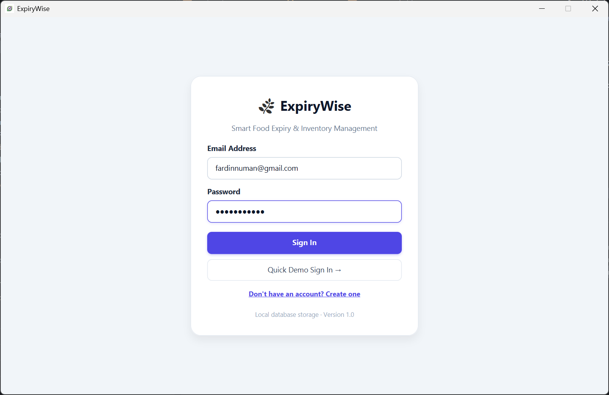                 | 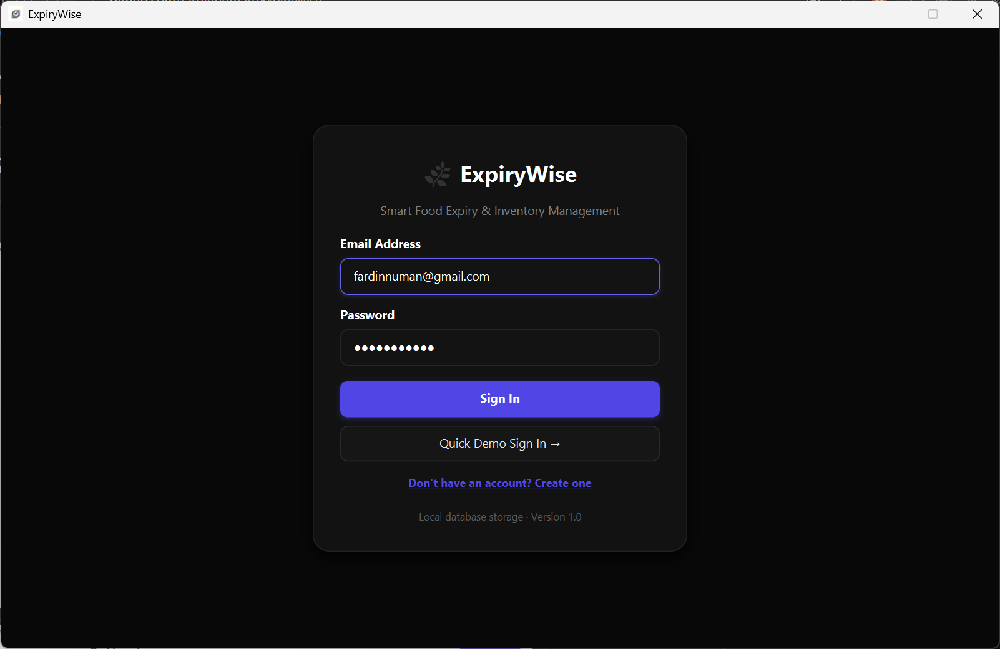                 | User Authentication & Registration Interface |
| 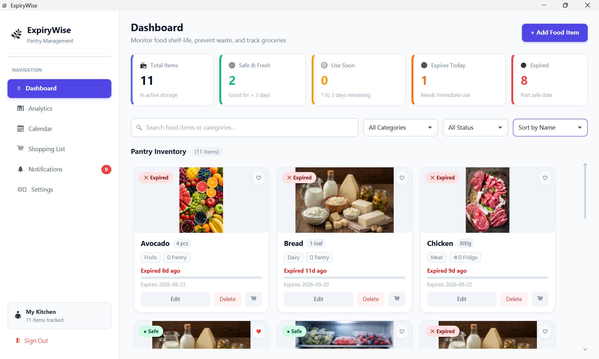         | 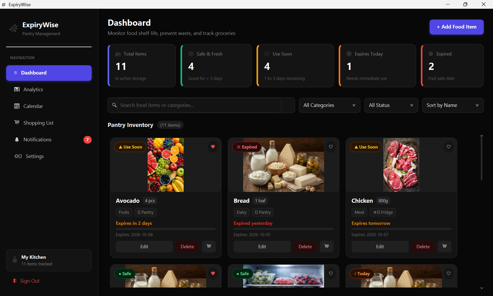         | Responsive Pantry Inventory Dashboard        |
| 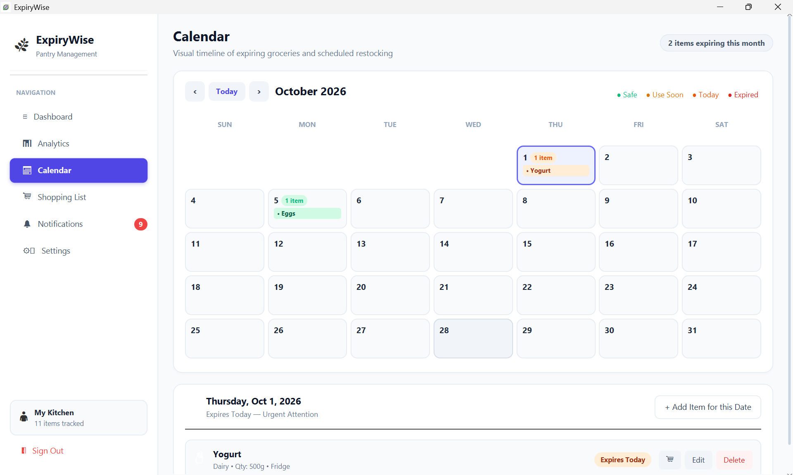           | 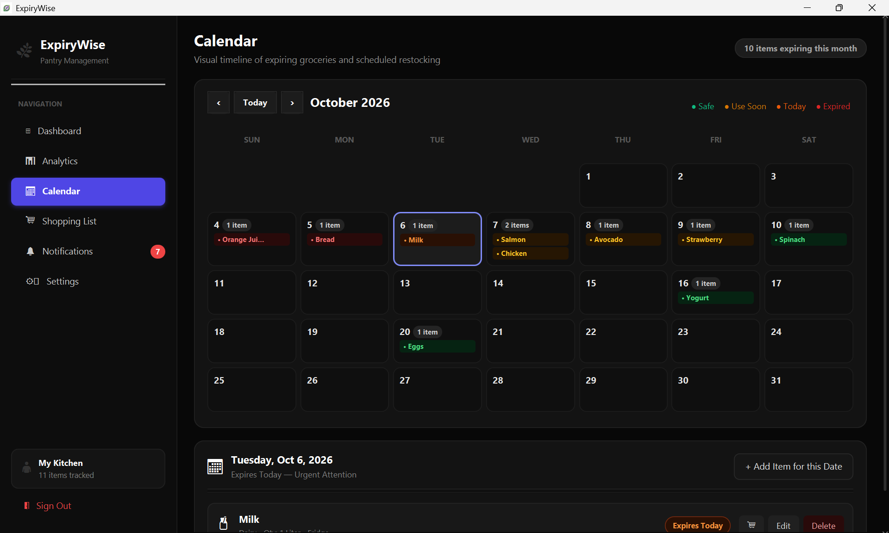           | Interactive Monthly Expiry Calendar          |
| 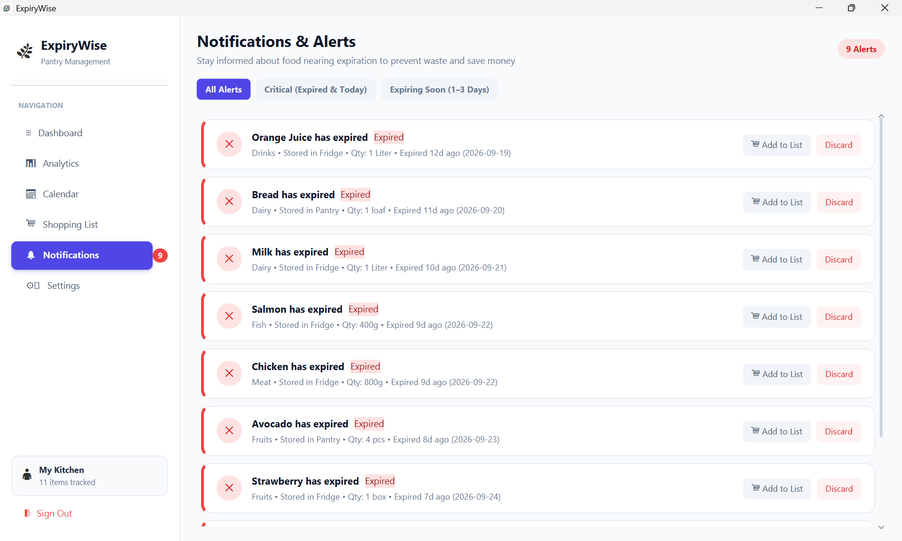 | 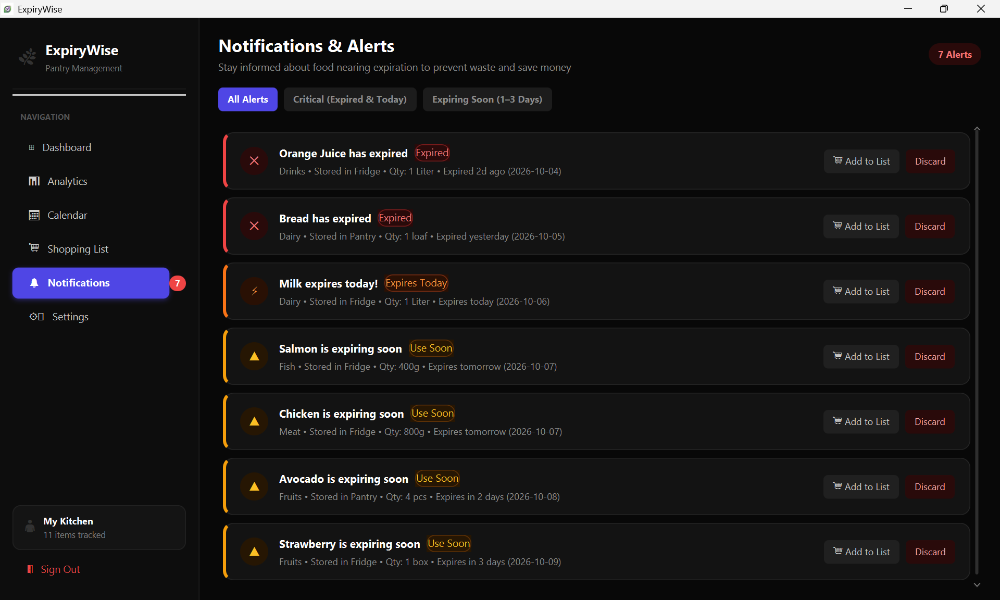 | Notification & Urgent Triage Center          |
| 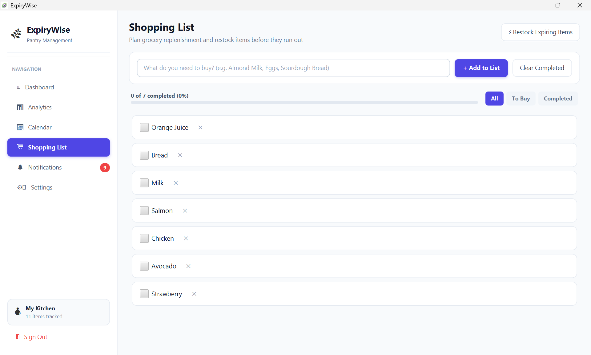      | 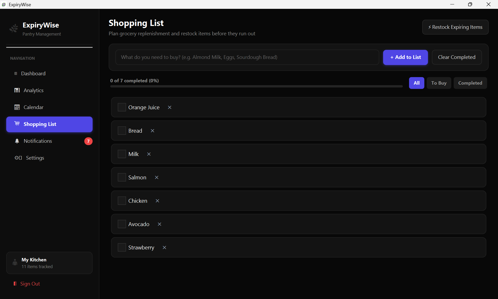      | Smart Shopping List & Restock Module         |
| 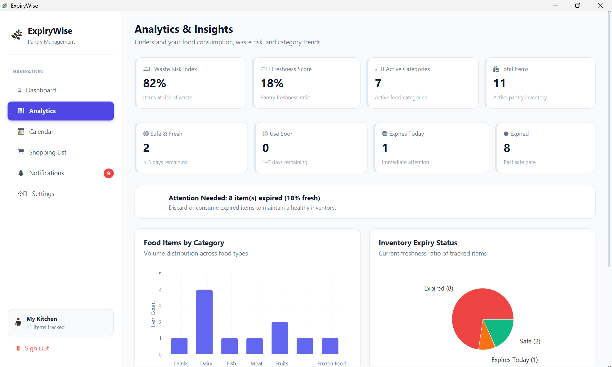         | 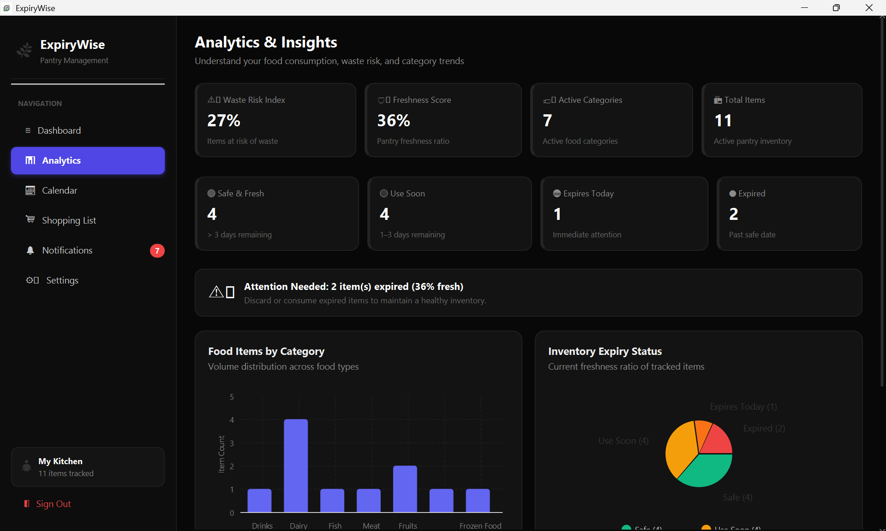         | Kitchen Analytics Dashboard                  |
| 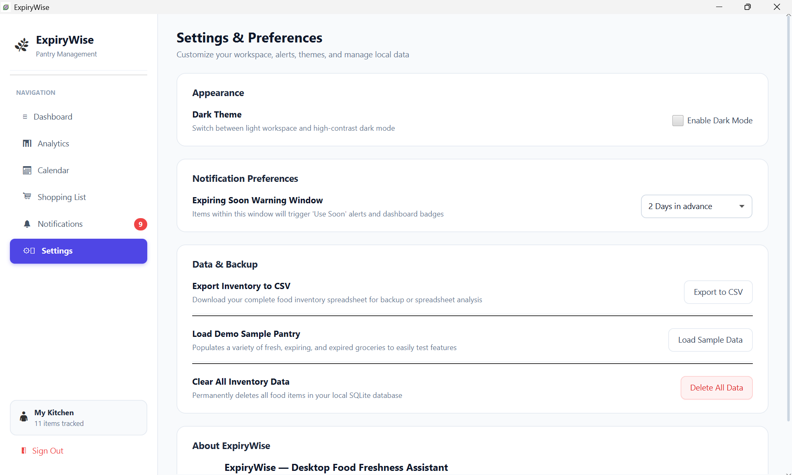           | 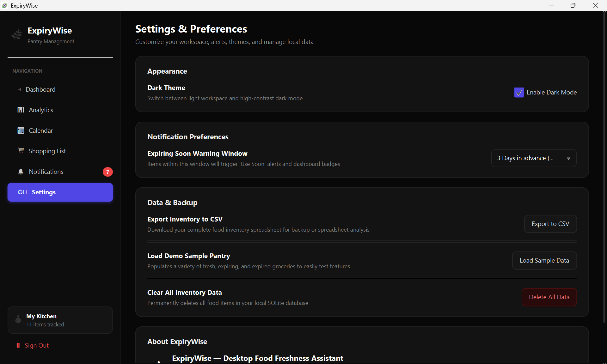           | Settings Interface with Dark Theme 

## 📊 System Documentation & Academic Analyses

### 1. Feature Comparison Across Existing Solutions

The table below contrasts ExpiryWise with commercial mobile applications and manual methods.

| Feature / Metric | CozZo (Mobile) | Fridge Pal (iOS) | Beep (Android/iOS) | Spreadsheets | ExpiryWise (This Project) |
|---|:---:|:---:|:---:|:---:|:---:|
| **Platform Target** | Mobile (iOS) | Mobile (iOS) | Mobile (Cross) | Desktop/Web | **Desktop (Cross-Platform)** |
| **Cost & Licensing** | Paid Subscription | Freemium | Freemium | Office License | **100% Free & Open-Source** |
| **Local Offline Operation** | Partial (Cloud req.) | Yes | Partial | Yes | **100% Offline (SQLite)** |
| **User Privacy & Telemetry** | Cloud Analytics | Local | Ad Tracking | Local / Cloud | **Zero Data Sharing + SHA-256** |
| **Responsive Card Grid UI** | List view | Simple list | Barcode list | Tabular rows | **Fluid Multi-Column Grid** |
| **Dynamic Freshness Decay Meter** | Simple date | Simple date | Days counter | Custom formula | **Mathematical Decay Ratio** |
| **Urgency Alert Triage Hub** | Push alert | Push alert | Push alert | Conditional formatting | **Dedicated Priority Triage Hub** |
| **Interactive Monthly Calendar** | No | No | No | Plug-in required | **Full Monthly Calendar Drawer** |
| **Auto-Add Expiring to Shopping**| Manual | Manual | No shopping list | Manual copy | **One-Click Automated Restock** |
| **Visual Kitchen Analytics** | Basic (Paid) | No | No | Manual pivot | **Interactive Pie & Bar Charts** |
| **Theme Engine (Light/Dark)** | Limited | Fixed light | System default | Manual styling | **Hot-Swappable Dual CSS** |
| **RFC 4180 CSV Export** | Paid tier | No | No | Native | **Built-In One-Click Export** |

---

### 2. Gap Analysis and Solutions Matrix

| Identified Market Gap | Root Cause in Existing Solutions | Technical Solution Implemented in ExpiryWise |
|---|---|---|
| **High Friction in Food Expiry Tracking** | Manual date math or navigating complex multi-level submenus | Real-time `ChronoUnit` date diffs mapped to color-coded countdown badges and decay progress meters |
| **Neglected Desktop Environment** | Developers prioritize commercial ad-supported mobile apps | High-performance, lightweight JavaFX 21 desktop app consuming <60MB RAM |
| **Invasive Cloud Tracking & Subscriptions** | Monetization via user habit analytics and recurring paywalls | Embedded local SQLite 3 database; zero external server dependencies, 100% private |
| **Disconnect Between Expiration & Grocery Restock** | Inventory and shopping lists exist as separate, unlinked silos | Smart "Auto-Add Expiring" algorithm automatically scanning near-expiry items into grocery checklist |
| **Absence of Visual Temporal Planning** | Standard apps display basic text lists without calendar context | Interactive monthly calendar grid with daily count pills and slide-out inspection drawer |
| **Lack of Consumption Analytics** | Simple counters without actionable kitchen health insights | Freshness Score %, Waste Risk %, interactive JavaFX PieChart and Category BarChart |

---
### 3. Technology Stack Justification

| Technology / Tool | Version | Category | Technical Justification |
|---|:---:|---|---|
| **Java** | 21 LTS | Programming Language | Provides a stable LTS platform, strong type safety, object-oriented programming and modern language features. |
| **JavaFX** | 21.0.6 | GUI Framework | Provides a modern framework for feature-rich desktop interfaces with FXML, CSS styling, animations and data visualization. |
| **FXML** | JavaFX 21 | UI Markup | Provides declarative UI definitions, separating interface layout from controller logic and supporting structured application design. |
| **CSS** | JavaFX CSS | Styling | Externalizes interface styling and enables consistent visual design and runtime theme switching. |
| **SQLite** | 3.50.3.0 | Database | Provides a lightweight, serverless relational database suitable for local desktop applications with minimal configuration. |
| **JDBC** | Xerial 3.50.3 | DB Connectivity | Provides standard Java database connectivity and supports parameterized queries through `PreparedStatement`. |
| **Apache Maven** | 3.9+ | Build Automation | Manages dependencies, project configuration and standardized build and execution workflows. |
| **Git & GitHub** | - | Version Control | Supports source-code versioning, collaborative development, change tracking and project documentation. |
| **JUnit 5** | 5.10.2 | Testing | Provides a structured framework for unit testing application logic independently of the graphical interface. |

---

## 🏗️ System Architecture & Design Patterns

ExpiryWise is built on a multi-tier layered architecture incorporating the **Model-View-Controller (MVC)** and **Data Access Object (DAO)** design patterns.

### 5-Tier Layered Architecture Diagram

```
┌────────────────────────────────────────────────────────────────────────────────────────┐
│  1. PRESENTATION LAYER (View)                                                          │
│     ├── FXML Layouts (login.fxml, dashboard.fxml, calendar.fxml, etc.)                 │
│     ├── CSS Stylesheets (style.css [Light] & dark.css [Dark])                          │
│     └── Static Media (Category Image Fallbacks, Application Icons)                     │
└───────────────────────────────────────────┬────────────────────────────────────────────┘
                                            │ User Events (ActionEvents, Keystrokes)
                                            ▼
┌────────────────────────────────────────────────────────────────────────────────────────┐
│  2. CONTROLLER LAYER (Event Dispatch & UI State)                                       │
│     ├── LoginController           ├── MainController         ├── DashboardController   │
│     ├── FoodDialogController      ├── EditFoodController     ├── CalendarController    │
│     ├── NotificationsController   ├── ShoppingListController ├── AnalyticsController   │
│     └── SettingsController                                                             │
└───────────────────────────────────────────┬────────────────────────────────────────────┘
                                            │ Dispatches Domain Requests
                                            ▼
┌────────────────────────────────────────────────────────────────────────────────────────┐
│  3. SERVICE LAYER (Business Logic & Algorithms)                                        │
│     ├── FoodService               (Expiry rules, decay math, freshness scoring)        │
│     ├── ShoppingListService       (Checklist management, auto-restock algorithm)       │
│     └── ThemeManager              (Observer pattern dynamic stylesheet registry)       │
└───────────────────────────────────────────┬────────────────────────────────────────────┘
                                            │ Executes CRUD Operations
                                            ▼
┌────────────────────────────────────────────────────────────────────────────────────────┐
│  4. DATA ACCESS LAYER (DAO Pattern - Parameterized SQL)                                │
│     ├── FoodDAO                   (CRUD SQL for foods table)                           │
│     ├── ShoppingListDAO           (CRUD SQL for shopping_items table)                  │
│     └── UserDAO                   (SHA-256 cryptographic password verification)        │
└───────────────────────────────────────────┬────────────────────────────────────────────┘
                                            │ JDBC Connection / Statement Execution
                                            ▼
┌────────────────────────────────────────────────────────────────────────────────────────┐
│  5. DATABASE LAYER (Local Disk Persistence)                                            │
│     └── SQLite 3 Database Engine  (Local single file: expirywise.db)                   │
└────────────────────────────────────────────────────────────────────────────────────────┘
```

### Annotated Project Directory Tree

```
ExpiryWise/
├── pom.xml                                      # Maven dependencies (JavaFX 21, SQLite JDBC, JUnit 5)
├── .gitignore                                   # Excludes target/, *.db, food-images/, IDE metadata
├── README.md                                    # Comprehensive project documentation
├── expirywise.db                                # Embedded SQLite database file
├── src/main/java/com/expirywise/
│   ├── App.java                                 # JavaFX entry point; boots DB & registers theme
│   ├── database/
│   │   └── DatabaseManager.java                 # JDBC connection manager & schema auto-migrations
│   ├── model/
│   │   ├── User.java                            # User account entity (ID, email, name, hash)
│   │   ├── Food.java                            # Food item entity (dates, category, location, photo)
│   │   └── ShoppingItem.java                    # Shopping item entity (ID, title, completion status)
│   ├── dao/
│   │   ├── UserDAO.java                         # SHA-256 hashing & user authentication queries
│   │   ├── FoodDAO.java                         # Parameterized SQL CRUD for pantry items
│   │   └── ShoppingListDAO.java                 # SQL CRUD for shopping checklist & auto-purges
│   ├── service/
│   │   ├── FoodService.java                     # Shelf-life date differentials & decay ratio math
│   │   └── ShoppingListService.java             # Shopping list bulk actions & auto-restock logic
│   ├── controller/
│   │   ├── LoginController.java                 # Sign In / Register toggle, form validation & demo bypass
│   │   ├── MainController.java                  # Master shell navigation, view router & urgent badge
│   │   ├── DashboardController.java             # Responsive card grid, search engine & filter pipeline
│   │   ├── FoodDialogController.java            # Modal dialog for adding items with photo selector
│   │   ├── EditFoodController.java              # Modal dialog for editing existing inventory records
│   │   ├── CalendarController.java              # Monthly calendar grid & side-drawer day inspector
│   │   ├── NotificationsController.java         # Priority-sorted triage alert center
│   │   ├── ShoppingListController.java          # Checklist UI & "Auto-Add Expiring" automation
│   │   ├── AnalyticsController.java             # Kitchen health metrics, status pie & category charts
│   │   └── SettingsController.java              # Dark theme toggle, threshold selector & CSV export
│   └── util/
│       ├── ImageUtil.java                       # Image file picker, disk copy & timestamping
│       └── ThemeManager.java                    # Scene listener registry for runtime CSS switching
└── src/main/resources/
    ├── css/
    │   ├── style.css                            # Clean Light Theme design tokens
    │   └── dark.css                             # High-contrast Dark Theme design tokens
    ├── fxml/
    │   ├── login.fxml                           # Authentication view markup
    │   ├── main.fxml                            # Master application shell & sidebar navigation
    │   ├── dashboard.fxml                       # Inventory grid & search/filter bar markup
    │   ├── food-dialog.fxml                     # Add item modal markup
    │   ├── edit-food.fxml                       # Edit item modal markup
    │   ├── calendar.fxml                        # Monthly calendar & side-drawer markup
    │   ├── notifications.fxml                   # Urgency triage center markup
    │   ├── shopping-list.fxml                   # Shopping checklist markup
    │   ├── analytics.fxml                       # Chart visualizers markup
    │   └── settings.fxml                        # Preferences & data export markup
    └── images/
        ├── category/                            # High-res stock imagery for all 9 food categories
        │   ├── Dairy.jpg, Drinks.jpg, Fish.jpg, Frozen Food.jpg, Fruits.jpg,
        │   └── Meat.jpg, Others.jpg, Snacks.jpg, Vegetables.jpg
        └── icon/
            └── ExpiryWise.jpg                   # Application window and stage icon
```

---

## 💾 Database Schema & Normalization

The SQLite database (`expirywise.db`) is structured into three normalized tables conforming to **Third Normal Form (3NF)**:
1. **1NF**: All columns contain atomic, indivisible values.
2. **2NF**: No partial dependencies; all non-key attributes depend fully on the primary key (`id`).
3. **3NF**: No transitive dependencies exist between non-key fields.

| Table | Column | Type | Constraints | Description |
|---|---|:---:|:---:|---|
| `users` | `id` | INTEGER | PRIMARY KEY AUTOINCREMENT | Unique user sequence identifier |
| `users` | `name` | TEXT | NULLABLE | User display name |
| `users` | `email` | TEXT | UNIQUE NOT NULL COLLATE NOCASE | Unique case-insensitive login identifier |
| `users` | `password_hash` | TEXT | NOT NULL | 64-character SHA-256 cryptographic digest |
| `users` | `created_at` | TEXT | NOT NULL | ISO-8601 account creation timestamp |
| `foods` | `id` | INTEGER | PRIMARY KEY AUTOINCREMENT | Unique food item identifier |
| `foods` | `name` | TEXT | NOT NULL | Title of grocery item (e.g. Milk, Salmon) |
| `foods` | `category` | TEXT | DEFAULT 'Others' | Classification (Dairy, Fruits, Meat, etc.) |
| `foods` | `quantity` | TEXT | DEFAULT '1' | Packaging quantity (e.g. 500g, 1 Liter) |
| `foods` | `purchase_date` | TEXT | NULLABLE | ISO-8601 grocery purchase date |
| `foods` | `expiry_date` | TEXT | NOT NULL | ISO-8601 expiration date |
| `foods` | `location` | TEXT | DEFAULT 'Fridge' | Storage zone (Fridge, Freezer, Pantry) |
| `foods` | `is_favorite` | INTEGER | DEFAULT 0 | Favorite tag (1 = Favorite, 0 = Standard) |
| `foods` | `image` | TEXT | NULLABLE | Local disk file path to uploaded photo |
| `shopping_items` | `id` | INTEGER | PRIMARY KEY AUTOINCREMENT | Unique shopping task identifier |
| `shopping_items` | `item_name` | TEXT | NOT NULL | Title of item to purchase |
| `shopping_items` | `is_completed` | INTEGER | DEFAULT 0 | Status (1 = Completed, 0 = Pending) |

---

## 👥 Team Structure & Roles 

**Supervisor:** Shyla Afroge, Associate Professor, Dept. of CSE, RUET

### Workload Allocation Matrix

| Team Member | Academic Role | Primary Functional Ownership |
|---|---|---|
| **Fardin Bin Aslam Numan** | **Lead Architect & Core Systems Engineer** | • Core project scaffolding, build plugins & Maven dependency management<br>• User authentication model, SHA-256 DAO and login UI (`UserDAO`, `LoginController`)<br>• Food domain entity and shelf-life calculation algorithms (`Food`, `FoodService`)<br>• Master application layout shell & view routing (`MainController`, `main.fxml`)<br>• Food creation/edit modal dialogs & image processor (`FoodDialogController`, `ImageUtil`)<br>• Responsive inventory dashboard with search & filter engine (`DashboardController`)<br>• Kitchen analytics dashboard with visual charts (`AnalyticsController`) |
| **Adita Anan Orin** | **Co-Developer / Automation & Perishables UX** | • SQLite database connection manager & schema migrations (`DatabaseManager`)<br>• Food Data Access Object layer with parameterized queries (`FoodDAO`)<br>• Shopping list entity, DAO, service & controller (`ShoppingItem`, `ShoppingListDAO`, `ShoppingListService`)<br>• Smart "Auto-Add Expiring" grocery automation engine<br>• Monthly expiry calendar grid & day inspection panel (`CalendarController`, `calendar.fxml`)<br>• Urgent notification triage center & real-time sidebar badge (`NotificationsController`)<br>• Dark mode CSS architecture & ThemeManager listener system (`ThemeManager`, `dark.css`)<br>• Settings interface, RFC 4180 CSV inventory exporter and demo data generator (`SettingsController`) |

> For the comprehensive, code-level architectural analysis of each contributor's algorithms, implementation logic and source file responsibility matrix, please refer to the dedicated **[**`TEAM_CONTRIBUTIONS.md`**](TEAM_CONTRIBUTIONS.md)** document.

---

## 🚀 Installation & Setup Guide

### Prerequisites

- **Java Development Kit (JDK) 21** or higher ([Download](https://adoptium.net/))
- **Maven** 3.8+ ([Download](https://maven.apache.org/download.cgi))
- **Git** ([Download](https://git-scm.com/))

### Option A: Automated 1-Click Setup (Recommended)

If your computer or IDE does not yet have Java 21 LTS or Apache Maven installed, you can use the automated installer script:

1. **Run the Automated Setup Script (Windows):**
   Double-click or run from terminal:
   ```cmd
   setup-prerequisites.bat
   ```
   *This script automatically detects your environment, installs Microsoft OpenJDK 21 and Apache Maven via `winget` if missing, sets the system PATH and offers to launch ExpiryWise.*

2. Alternatively, view **[`SETUP.md`](SETUP.md)** for copy-paste installation commands.

---

### Option B: Manual Terminal Execution

If you already have **JDK 21 LTS** and **Maven 3.9+** configured on your system PATH (`java -version` and `mvn -version`):

1. **Clone the repository:**
   ```bash
   git clone https://github.com/your-username/ExpiryWise.git
   cd ExpiryWise
   ```

2. **Clean, compile and run the JavaFX application:**
   ```bash
   mvn clean javafx:run
   ```

3. **Package as a standalone executable JAR:**
   ```bash
   mvn clean package
   ```

---

### Option C: Visual Studio Code Setup

To run and debug directly inside **VS Code**:
1. Open the **Extensions** view (`Ctrl + Shift + X`).
2. Install the **Extension Pack for Java** (by Microsoft) and **Maven for Java**.
3. Open the `ExpiryWise` project root folder in VS Code (`File > Open Folder...`).
4. Ensure VS Code is configured to use JDK 21 in your `settings.json`:
   ```json
   "java.configuration.runtimes": [
       { "name": "JavaSE-21", "path": "C:\\Program Files\\Microsoft\\jdk-21.x.x", "default": true }
   ]
   ```
5. Open a terminal in VS Code (`Ctrl + ~`) and execute `mvn clean javafx:run`, or open `src/main/java/com/expirywise/ExpiryWiseApp.java` and click **Run**.

---

### Demo Evaluation Credentials

For rapid course evaluation, use the pre-configured demo account or click the **"Quick Demo Sign-In"** button on the login screen:
- **Email**: `demo@expirywise.app`
- **Password**: `password123` *(or `demo2026`)*

*Alternatively, click "Don't have an account? Create one" to register a new user.*

---

## 🧪 Quality Assurance & Testing

Automated unit tests validate domain logic independently of the JavaFX graphical interface. Run tests with:

```bash
mvn test
```

Key test validations cover:
- **Authentication**: SHA-256 hash generation consistency and credential matching.
- **Shelf-Life Status**: Expiration status boundary conditions (yesterday, today, tomorrow, +3 days, +10 days).
- **Duplicate Prevention**: Shopping list restock validation preventing duplicate entries.
- **Database Safety**: Parameterized query execution and connection pool teardown.

---

## 🔮 Future Scope & Roadmap

- 📱 **Mobile & Family Cloud Synchronization**: Develop an optional cloud synchronization bridge (via PostgreSQL/Firebase) to synchronize pantry updates across domestic family members.
- 📷 **Optical Barcode & QR Code Scanner**: Integrate camera-based optical barcode scanning querying the OpenFoodFacts REST API to auto-populate product names, brands and typical shelf-life spans.
- 🍳 **AI-Powered Recipe Suggestion Engine**: Implement an intelligent heuristic or LLM-based recipe recommendation engine that suggests culinary recipes based strictly on ingredients currently flagged as `Use Soon` or `Expires Today`.
- 🔔 **OS-Level Native Push Notifications**: Extend the alerting engine to dispatch native Windows Notification Toast alerts even when the application window is minimized.

---

## 📄 License & Institutional Context

Distributed under the **MIT License**. See the standalone [**`LICENSE`**](LICENSE) file for complete terms and copyright notices.

Developed for academic evaluation in **CSE 2100 - Software Development Project I** at the **Department of Computer Science & Engineering, Rajshahi University of Engineering & Technology (RUET)**.
